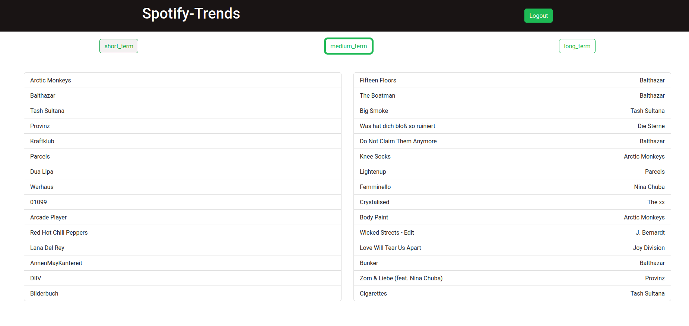

# Spotify Trends Viewer - React

This is a test project for playing around with React and the Spotify-API.

It contains a react-webapp, which allows to analyze the previous data of the given Spotify account.

This app works with the official [Spotify API](https://developer.spotify.com/documentation/web-api/reference/#/).

To run this project, you have to put the credentials into the ```.env``` file. The token can be accessed at the [Spotify delevoper page](https://developer.spotify.com/dashboard/applications) ad the dashboard, if you have an account.


### First Version __---WIP---__



## Available Scripts

In the project directory, you can run:

### `npm start`

Runs the app in the development mode.\
Open [http://localhost:3000](http://localhost:3000) to view it in the browser.

The page will reload if you make edits.\
You will also see any lint errors in the console.

## Learn More

To learn React, check out the [React documentation](https://reactjs.org/).
